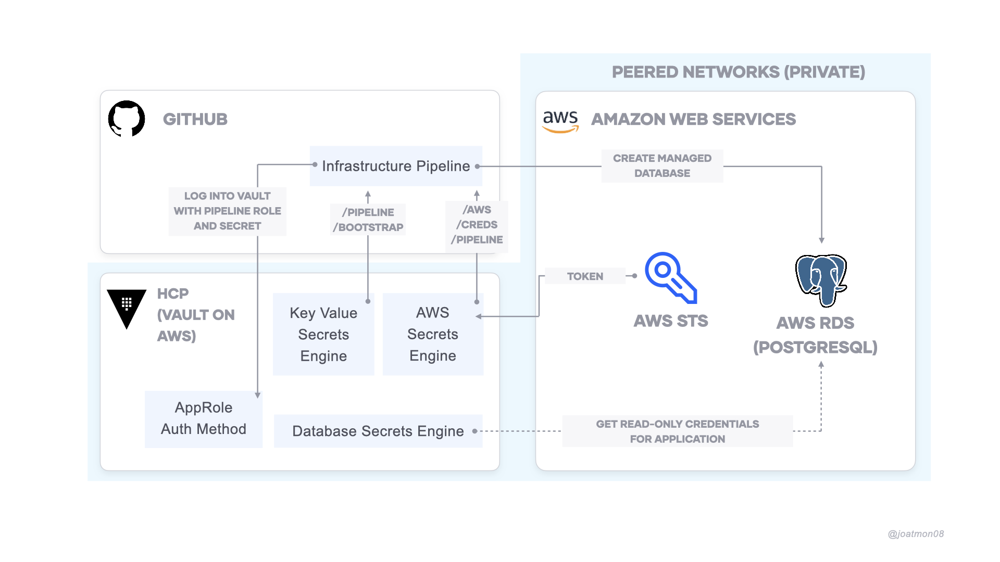

# An Example Infrastructure Pipeline

This example uses:

- Amazon Web Services
- GitHub Actions
- Terraform 0.14+
- Vault 1.5+
- HashiCorp Cloud Platform Vault (managed Vault offering)
- Terraform Cloud (for configuring Vault, uses `vault/` directory)

The infrastructure pipeline runs Terraform to create a PostgreSQL database
in AWS. It securely retrieves secrets from HashiCorp Vault.



## Usage

1. In your CLI, set the Vault address, token, and namespace.
   ```shell
   $ export VAULT_ADDR=
   $ export VAULT_TOKEN=
   $ export VAULT_NAMESPACE=
   ```

1. Get Vault secret ID.
   ```shell
   $ make get-secret
   ```

1. Go to the GitHub repository's secrets.

1. Set the following repository secrets:
   1. `VAULT_ADDR`: address of Vault
   1. `VAULT_NAMESPACE`: `admin`
   1. `VAULT_ROLE_ID`: `infrastructure-pipeline`
   1. `VAULT_SECRET_ID`: add secret ID from CLI

1. Make changes to this repository to execute Terraform.

## Notes

1. The GitHub Actions workflow accesses Vault over public internet. To access Vault
   over private connection, you will want to deploy a self-hosted runner or GitHub
   Enterprise. Vault configures the PostgreSQL database over a private connection.

1. The demo uses HashiCorp Cloud Platform. You can substitute the Vault endpoint
   with your own Vault instance, as long as it can connect to AWS.## Requirements
