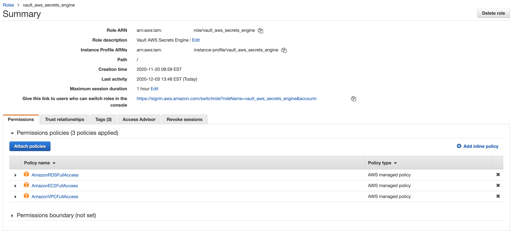

# Vault Configuration for Secrets Engines and Auth Methods

This example uses Terraform to update Vault secrets engines and auth methods.

## AWS Secrets Engine

When configuring the AWS Secrets Engine, you must include the AWS access key
and secret as well as the role it can assume in the account. The role must at
minimum have policies to allow Terraform to create RDS, EC2, and VPC resources.

## Azure Secrets Engine

You can also use this configuration to configure the Azure secrets engine,
which will generate service principals. Reference the HashiCorp
[Learn tutorial](https://learn.hashicorp.com/tutorials/vault/azure-secrets)
for initial configuration in Azure.

## Database Secrets Engine

The database secrets engine will be mounted but not configured. This can
only be configured after the database exists.

## Key-Vault Secrets Engine, Version 2

In order to start the database with an adminstrative password, this
configuration stores a "bootstrap" username and password
in the static key-value store for Vault.

## Requirements

| Name | Version |
|------|---------|
| terraform | ~>0.13 |
| aws | ~> 3.16.0 |
| vault | ~> 2.15.0 |

## Providers

No provider.

## Inputs

| Name | Description | Type | Default | Required |
|------|-------------|------|---------|:--------:|
| db\_password | password for PostgreSQL database | `string` | n/a | yes |
| db\_username | username for PostgreSQL database | `string` | n/a | yes |
| environment | environment for resources | `string` | n/a | yes |
| pipeline\_name | name of infrastructure pipeline | `string` | n/a | yes |
| region | AWS Region | `string` | n/a | yes |
| vault\_network\_address | network IP address range for Vault | `string` | n/a | yes |

## Outputs

No output.
